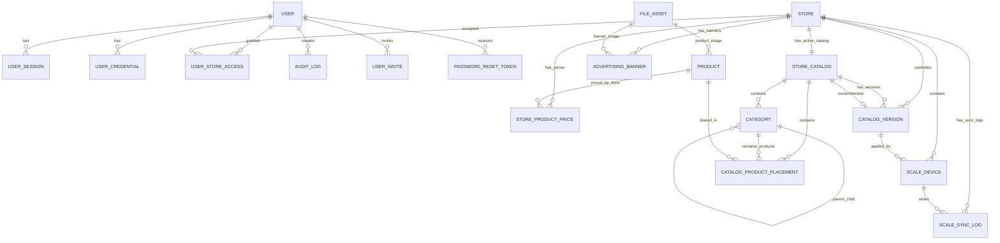
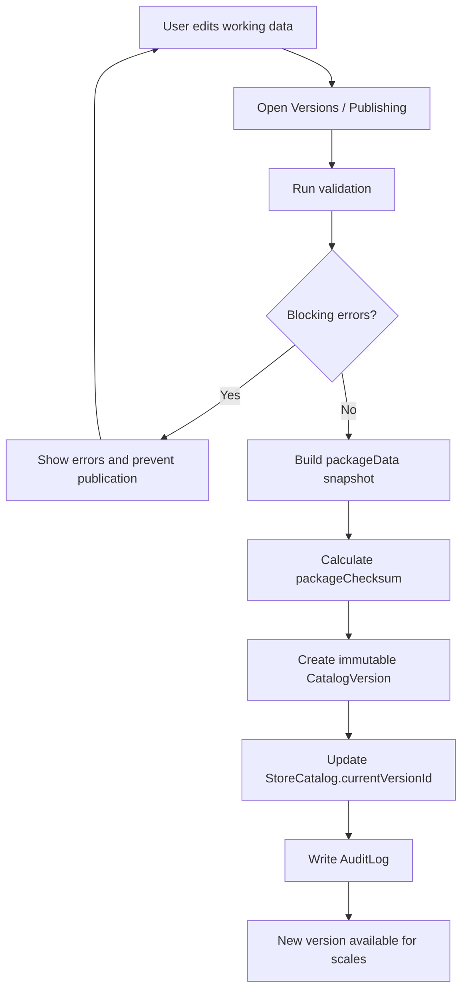
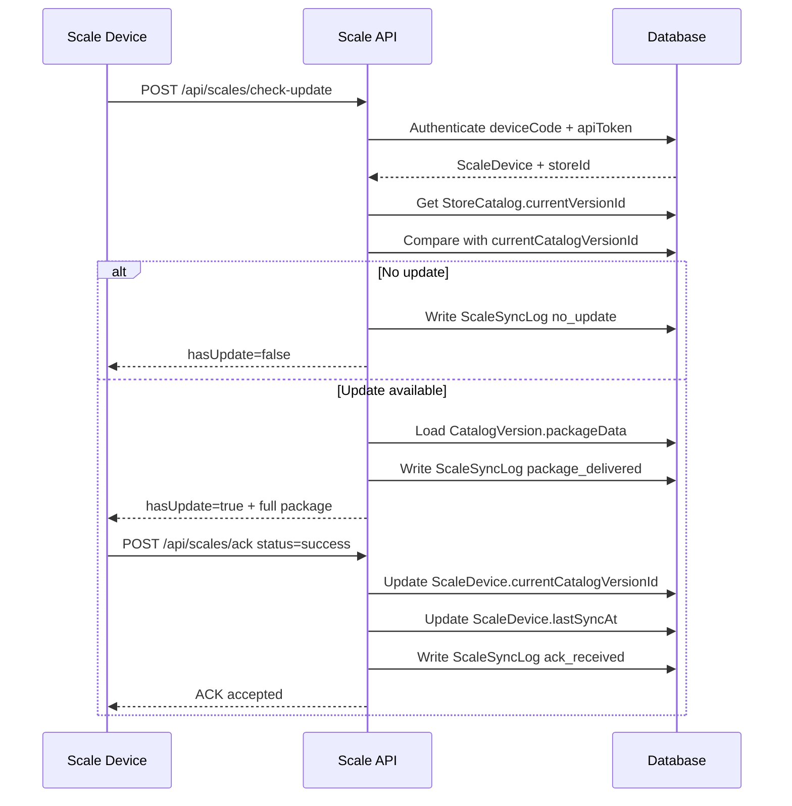

# PRD — Веб-интерфейс администрирования и настройки электронных весов

**Project:** Scale Admin MVP  
**Date:** 2026-05-06  
**Status:** Draft for development planning  
**Target readers:** product owner, frontend developer, backend developer, AI coding agent  

---

## 1. Обзор приложения и цели

### 1.1. Идея продукта

Система представляет собой модульный веб-сервис для администрирования электронных весов в продуктовых магазинах.

Через веб-интерфейс пользователи управляют:

- общим справочником товаров;
- каталогами конкретных магазинов;
- категориями внутри каталога магазина;
- размещением товаров в категориях;
- ценами по магазинам;
- рекламными баннерами на экране весов;
- магазинами;
- весами;
- публикацией версий;
- логами и аудитом.

Электронные весы периодически делают HTTP-запросы на сервер. Сервер проверяет, есть ли новая опубликованная версия пакета данных для магазина устройства. Если версия изменилась, весы получают полный пакет данных. После применения пакета весы отправляют ACK.

### 1.2. Ключевая архитектурная идея

В MVP система разделяет два состояния данных:

1. **Редактируемые рабочие данные** — товары, категории, размещения, цены и баннеры в обычных таблицах.
2. **Опубликованное состояние** — неизменяемый JSON-снимок в `CatalogVersion.packageData`.

Весы получают только опубликованные версии. Весы не читают текущие рабочие таблицы напрямую.

### 1.3. Цели MVP

- Позволить оператору управлять каталогом назначенного магазина.
- Позволить оператору самостоятельно публиковать изменения для своего магазина.
- Позволить администратору управлять магазинами, весами, пользователями, доступами и логами.
- Обеспечить версионирование опубликованных данных.
- Обеспечить HTTP-синхронизацию весов через `check-update` и `ack`.
- Включить рекламные баннеры в общий пакет данных для весов.
- Заложить расширяемую архитектуру без усложнения первой версии.

### 1.4. Не входит в MVP

- 1C / ERP интеграция.
- Excel / CSV импорт.
- История цен как отдельный раздел.
- Будущие цены, акции и прайс-листы.
- Delta-обновления.
- Отдельное версионирование рекламы.
- Группы магазинов.
- Несколько активных каталогов на магазин.
- Отложенные публикации.
- Откаты версий.
- Расширенные permissions.
- Полноценная backup-стратегия.
- Cloud object storage.
- Внешняя аналитика и мониторинг.

---

## 2. Целевая аудитория и роли

## 2.1. Администратор

Администратор управляет системой целиком.

Возможности:

- видеть все магазины;
- создавать и редактировать магазины;
- регистрировать, блокировать и настраивать весы;
- управлять пользователями;
- назначать операторам доступ к магазинам;
- видеть глобальные логи;
- видеть логи синхронизации;
- публиковать версии для любого магазина;
- перевыпускать токены весов.

## 2.2. Оператор / товаровед

Оператор работает только с назначенными магазинами.

Возможности:

- авторизоваться;
- видеть доступные магазины;
- управлять товарами в общем справочнике;
- управлять категориями внутри каталога доступного магазина;
- размещать товары в категориях;
- менять цены в доступном магазине;
- управлять баннерами магазина;
- запускать проверку перед публикацией;
- самостоятельно публиковать новую версию для доступного магазина;
- видеть простой статус публикации и синхронизации.

---

## 3. Масштаб MVP

Ориентировочные объёмы:

| Параметр | Значение |
|---|---:|
| Магазинов | 10 |
| Весов на магазин | 3 |
| Всего весов | 30 |
| Товаров в общем справочнике | 300 |
| Товаров в каталоге магазина | 100 |
| Категорий в каталоге | 20 |
| Частота check-update | 1 раз в день |
| Частота публикаций | реже 1 раза в день |

Выводы:

- full package inline подходит для MVP;
- delta-обновления не нужны;
- PostgreSQL + NestJS + Prisma достаточно;
- Docker Compose на одном VPS достаточно;
- сложная оптимизация логов не нужна;
- нужна стандартная пагинация, поиск и фильтры.

---

## 4. Основной пользовательский сценарий оператора

1. Оператор входит в систему.
2. Видит Dashboard со списком доступных магазинов.
3. Выбирает магазин.
4. Открывает вкладку `Catalog`.
5. Создаёт или редактирует категории.
6. Размещает товары в категориях.
7. При необходимости переходит в `Products` и создаёт новый товар.
8. Возвращается в каталог и добавляет товар.
9. Открывает `Prices`.
10. Задаёт цену товара для магазина.
11. Открывает `Advertising`.
12. Настраивает активные баннеры.
13. Открывает `Versions / Publishing`.
14. Запускает проверку.
15. Исправляет ошибки.
16. Публикует новую версию.
17. Проверяет статус обновления весов.

---

## 5. Информационная архитектура

## 5.1. Верхнеуровневые страницы

1. Login
2. Dashboard
3. Stores
4. Store Details
5. Products
6. Users & Access
7. Global Logs

## 5.2. Store Details

`Store Details` — центральная рабочая страница MVP. Реализована как single-page layout: все секции отрендерены стеком на одной странице, без табов и без отдельных под-маршрутов на секцию. Переключение между разделами осуществляется скроллом; внутри каждой секции есть собственные action-кнопки (Refresh, Create, Publish и т. п.).

Порядок секций сверху вниз:

- Overview (header с метаданными магазина: Address, Timezone, status)
- Catalog
- Prices
- Advertising
- Scale Devices
- Versions / Publishing
- Logs

Канонический URL страницы: `#store:{uuid}` (singular `store`, разделитель — двоеточие). См. §5.3 / §5.4.

## 5.3. Навигация администратора

Верхнеуровневые пункты и их канонические URL (приложение использует hash routing):

- Dashboard — default view (без хеша)
- Stores — `#stores`
- Products — `#products`
- Users & Access — `#users-access`
- Logs (Global Logs) — `#global-logs`

Внутри магазина (single-page layout, см. §5.2 — секции стеком, без табов):

- Overview
- Catalog
- Prices
- Advertising
- Scale Devices
- Versions
- Logs

Канонический URL страницы магазина: `#store:{uuid}` (singular + двоеточие).

## 5.4. Навигация оператора

Верхнеуровневые пункты и их канонические URL (приложение использует hash routing):

- Dashboard — default view (без хеша)
- Stores — `#stores`
- Products — `#products`

Внутри доступного магазина (single-page layout, см. §5.2 — секции стеком, без табов):

- Catalog
- Prices
- Advertising
- Versions
- простой статус обновления весов

Канонический URL страницы магазина: `#store:{uuid}` (singular + двоеточие).

---

## 6. Функциональные требования

## 6.1. Авторизация, сессии и роли

### Описание

Пользователи работают после авторизации. В MVP есть две роли: `admin` и `operator`.

### Требования

- вход по email и password;
- cookie-based server-side sessions;
- logout;
- idle timeout;
- absolute timeout;
- блокировка входа для `blocked` пользователей;
- приглашения пользователей;
- сброс пароля;
- одна роль на пользователя: `admin` или `operator`;
- backend-enforced RBAC.

### Acceptance criteria

- пользователь может войти с корректным email/password;
- пользователь не может войти с неверным паролем;
- `blocked` пользователь не может войти;
- после login создаётся server-side session;
- после logout session отзывается;
- operator не может открыть чужой магазин;
- admin имеет доступ ко всем магазинам;
- backend проверяет доступ на каждом protected endpoint.

---

## 6.2. Пользователи и доступы

### Требования

- admin создаёт приглашения;
- admin назначает роль;
- admin блокирует пользователя;
- admin выполняет soft delete;
- admin назначает оператору магазины;
- admin отзывает доступ к магазину;
- все изменения логируются.

### Acceptance criteria

- приглашение нельзя принять после `expiresAt`;
- приглашение нельзя принять повторно;
- нельзя создать дубль активного доступа `userId + storeId`;
- при отзыве доступа заполняется `revokedAt`;
- operator видит только назначенные магазины;
- изменение доступа попадает в `AuditLog`.

---

## 6.3. Магазины

### Модель

```text
Store
- id
- code
- name
- address
- timezone
- status
- createdAt
- updatedAt
```

### Правила

- `code` уникален;
- статусы: `active`, `inactive`, `archived`;
- один активный магазин = один основной активный каталог;
- несколькие каталоги, группы и шаблоны — future features.

### Acceptance criteria

- admin может создать магазин;
- admin может редактировать магазин;
- при создании active-магазина создаётся основной active-каталог;
- operator видит только назначенные магазины.

---

## 6.4. StoreCatalog

### Модель

```text
StoreCatalog
- id
- storeId
- name
- status
- currentVersionId
- createdAt
- updatedAt
```

### Правила

- статусы: `active`, `inactive`, `archived`;
- отдельный `draft` статус не нужен;
- рабочие данные живут в обычных таблицах;
- опубликованное состояние живёт в `CatalogVersion.packageData`;
- весы получают только опубликованные версии;
- `currentVersionId` обновляется после успешного создания версии.

### Acceptance criteria

- пользователь может открыть рабочий каталог магазина;
- публикация обновляет `StoreCatalog.currentVersionId`;
- весы не получают неопубликованные изменения.

---

## 6.5. Общий справочник товаров

### Модель

```text
Product
- id
- defaultPluCode
- name
- shortName
- description
- imageUrl
- barcode
- sku
- unit
- status
- createdAt
- updatedAt
```

### Поля

| Поле | Обязательно | Описание |
|---|---:|---|
| id | да | Внутренний идентификатор |
| defaultPluCode | да | PLU-код по умолчанию |
| name | да | Полное название |
| shortName | да | Короткое название для весов |
| description | нет | Описание |
| imageUrl | нет | Ссылка на изображение |
| barcode | нет | Штрихкод |
| sku | нет | Внутренний артикул |
| unit | да | `kg`, `g`, `piece` |
| status | да | `active`, `inactive`, `archived` |
| createdAt | да | Дата создания |
| updatedAt | да | Дата изменения |

### Правила

- товар — мастер-сущность;
- товар не содержит магазин, категорию или цену;
- operator и admin могут создавать и редактировать товары;
- `defaultPluCode` уникален в MVP;
- при публикации проверяется отсутствие дублей PLU внутри пакета магазина;
- при редактировании товара, используемого в каталогах, показывается предупреждение;
- изменения товаров логируются;
- archived-товар нельзя добавить в новое active-размещение;
- изменение товара не уходит на весы без публикации.

### Acceptance criteria

- нельзя создать товар без обязательных полей;
- нельзя создать дубль `defaultPluCode`;
- используемый товар редактируется только после предупреждения;
- товары можно искать по `name`, `shortName`, `defaultPluCode`, `sku`, `barcode`;
- изменения пишутся в `AuditLog`.

---

## 6.6. Категории

### Модель

```text
Category
- id
- catalogId
- parentId
- name
- shortName
- sortOrder
- status
- createdAt
- updatedAt
```

### Правила

- категория принадлежит каталогу, а не товару;
- категория не хранит `storeId` напрямую;
- `parentId` может ссылаться только на категорию из того же `catalogId`;
- циклы запрещены;
- вложенность до 2–3 уровней;
- `sortOrder` действует среди категорий одного уровня;
- archived-категорию нельзя использовать для новых размещений;
- при архивировании категории с активными товарами показывается предупреждение.

### Acceptance criteria

- можно создать root-категорию;
- можно создать child-категорию в пределах лимита глубины;
- нельзя создать цикл;
- нельзя выбрать parent из другого каталога;
- можно менять порядок категорий;
- дерево валидируется перед публикацией.

---

## 6.7. Размещение товаров в каталоге

### Модель

```text
CatalogProductPlacement
- id
- catalogId
- categoryId
- productId
- sortOrder
- status
- createdAt
- updatedAt
```

### Правила

- placement связывает `Product` и `Category` внутри `StoreCatalog`;
- `categoryId` должен принадлежать тому же `catalogId`;
- `productId` должен ссылаться на существующий неархивный товар;
- в MVP один товар может иметь только одно active-размещение в одном `catalogId`;
- модель должна позволять в будущем несколько размещений одного товара;
- при попытке добавить товар в другую категорию того же каталога система предлагает переместить существующее размещение;
- перемещение выполняется изменением `categoryId`;
- `sortOrder` работает внутри категории;
- `inactive` и `archived` размещения не попадают в пакет;
- active-размещение нельзя создать в archived-категории;
- active-размещение нельзя создать для archived-товара;
- при публикации у active-размещённого товара должна быть цена.

### Acceptance criteria

- можно добавить товар из справочника в категорию;
- нельзя добавить archived-товар;
- нельзя добавить товар в archived-категорию;
- нельзя создать второе active-размещение того же товара в том же каталоге;
- при повторном добавлении система предлагает переместить товар;
- порядок товаров в категории сохраняется.

---

## 6.8. Цены по магазинам

### Модель

```text
StoreProductPrice
- id
- storeId
- productId
- price
- currency
- status
- createdAt
- updatedAt
```

### Правила

- `Product` не хранит цену;
- цена задаётся для пары `storeId + productId`;
- в MVP одна active-цена на товар в магазине;
- цена используется при публикации;
- товар с active-размещением нельзя опубликовать без active-цены;
- изменение цены логируется;
- цена попадает на весы только после публикации;
- `currency` можно хранить как поле, для MVP использовать `RUB`;
- цена должна быть больше 0.

### UI: Prices tab

`Prices` — таблица товаров выбранного магазина.

Колонки:

- Product name
- Short name
- PLU
- SKU / barcode
- Category
- Current price
- Unit
- Status
- UpdatedAt

Обязательные возможности:

- поиск по `name`, `shortName`, `defaultPluCode`, `sku`, `barcode`;
- фильтр по категории;
- фильтр “без цены”;
- inline-редактирование цены;
- подсветка товаров без цены;
- подсветка некорректной цены;
- сохранение изменений;
- запись изменения цены в `AuditLog`.

### Acceptance criteria

- отображаются только товары активного каталога выбранного магазина;
- цена сохраняется на уровне магазина;
- изменение цены не меняет `Product`;
- товар без цены подсвечивается;
- публикация блокируется, если active-размещённый товар не имеет active-цены.

---

## 6.9. Рекламные баннеры

### Модель

```text
AdvertisingBanner
- id
- storeId
- imageUrl
- status
- sortOrder
- createdAt
- updatedAt
```

### Правила

- реклама в MVP — только изображения;
- изображение обязательно;
- баннеры задаются на уровне магазина;
- весы показывают active-баннеры по кругу;
- порядок показа определяется через `sortOrder`;
- длительность показа фиксированная и не настраивается;
- в пакет попадают только active-баннеры;
- изменение баннеров = новая опубликованная версия пакета;
- отдельная версия рекламы не создаётся;
- ACK подтверждает применение всего пакета;
- если active-баннеров нет, весы показывают пустую область или стандартную заглушку;
- изменения баннеров логируются.

### Ограничения изображений

- форматы: `jpg`, `png`, `webp`;
- максимальный размер: 2 МБ;
- соотношение сторон не валидируется;
- подготовка изображения под экран весов решается вне системы.

### PackageData fragment

```json
{
  "advertising": {
    "rotationMode": "loop",
    "banners": [
      {
        "id": "banner-id",
        "imageUrl": "https://example.com/uploads/banner.webp",
        "sortOrder": 1
      }
    ]
  }
}
```

### Acceptance criteria

- нельзя создать баннер без изображения;
- неподдерживаемый формат отклоняется;
- файл больше 2 МБ отклоняется;
- пользователь может менять порядок баннеров;
- в пакет попадают только active-баннеры;
- изменение баннеров требует новой публикации.

---

## 6.10. File upload

### Модель

```text
FileAsset
- id
- originalFileName
- storagePath
- publicUrl
- mimeType
- sizeBytes
- uploadedByUserId
- createdAt
```

### Правила

- local storage используется для MVP;
- backend проверяет формат и размер файла;
- `Content-Type` header не считается единственным источником истины;
- используются server-generated filenames;
- frontend получает `publicUrl` после загрузки;
- `Product.imageUrl` и `AdvertisingBanner.imageUrl` могут ссылаться на `FileAsset.publicUrl`;
- файл, использованный в опубликованной версии, не должен удаляться физически сразу.

### Acceptance criteria

- можно загрузить изображение товара;
- можно загрузить рекламный баннер;
- неподдерживаемые форматы отклоняются;
- слишком большие файлы отклоняются;
- upload action логируется.

---

## 6.11. Публикация версии

### Модель

```text
CatalogVersion
- id
- catalogId
- storeId
- versionNumber
- status
- publishedByUserId
- publishedAt
- basedOnVersionId
- packageData
- packageUrl
- packageChecksum
- createdAt
```

### Правила

- версия создаётся только при публикации;
- версия неизменяемая;
- `versionNumber` уникален внутри `catalogId`;
- `basedOnVersionId` показывает базовую версию;
- `packageData` хранит готовый JSON-снимок;
- весы получают `packageData`;
- пакет не собирается заново из текущих таблиц при каждом запросе весов;
- `packageChecksum` считается по финальному содержимому;
- `StoreCatalog.currentVersionId` обновляется только после успешного создания версии;
- `ScaleDevice.currentCatalogVersionId` обновляется только после successful ACK;
- изменения после публикации требуют новой версии;
- banners входят в общий пакет.

### Проверки перед публикацией

Система проверяет:

- у всех active-размещённых товаров есть цена;
- у всех active-товаров есть `shortName`;
- у всех active-товаров есть `defaultPluCode`;
- нет дублей PLU внутри пакета магазина;
- все active-размещения ссылаются на active-товары;
- все active-размещения находятся в active-категориях;
- дерево категорий корректное и без циклов;
- `parentId` категории принадлежит тому же `catalogId`;
- `sortOrder` задан внутри каждого уровня;
- нет активных товаров вне категории;
- обязательные названия категорий заполнены;
- `shortName` категории не превышает лимит для весов;
- рекламные баннеры имеют валидные изображения.

### Типы результатов проверки

- `Blocking error` — публикация невозможна.
- `Warning` — публикация возможна, но пользователь видит предупреждение.

### Blocking errors MVP

- товар без цены;
- дубль PLU;
- archived-товар в active-размещении;
- active-размещение в archived-категории;
- сломанное дерево категорий;
- active-размещение с несуществующим товаром или категорией;
- невалидный рекламный баннер.

### Acceptance criteria

- пользователь может запустить проверку;
- blocking errors запрещают публикацию;
- успешная публикация создаёт новую `CatalogVersion`;
- `packageData` содержит каталог, товары, цены и баннеры;
- `currentVersionId` обновляется только после успешного создания версии;
- публикация пишется в `AuditLog`;
- опубликованную версию нельзя изменить.

---

## 6.12. PackageData

`CatalogVersion.packageData` — готовый payload для весов, а не копия структуры базы данных.

Пример структуры:

```json
{
  "version": {
    "id": "version-id",
    "versionNumber": 12,
    "publishedAt": "2026-05-06T12:00:00Z",
    "checksum": "..."
  },
  "store": {
    "id": "store-id",
    "code": "STORE-001",
    "name": "Магазин 001"
  },
  "catalog": {
    "id": "catalog-id",
    "name": "Основной каталог"
  },
  "categories": [
    {
      "id": "category-id",
      "name": "Фрукты",
      "shortName": "Фрукты",
      "sortOrder": 1,
      "items": [
        {
          "productId": "product-id",
          "plu": "1001",
          "name": "Яблоки красные весовые",
          "shortName": "Яблоки",
          "description": "Свежие яблоки",
          "imageUrl": "https://example.com/uploads/apple.webp",
          "barcode": "460...",
          "sku": "APL-001",
          "unit": "kg",
          "price": 129.99,
          "currency": "RUB",
          "sortOrder": 1
        }
      ],
      "children": []
    }
  ],
  "advertising": {
    "rotationMode": "loop",
    "banners": [
      {
        "id": "banner-id",
        "imageUrl": "https://example.com/uploads/banner.webp",
        "sortOrder": 1
      }
    ]
  }
}
```

Правила:

- пакет формируется только при публикации;
- весы не должны знать внутреннюю структуру таблиц;
- в пакет попадают только active-категории, active-размещения, active-товары, active-цены и active-баннеры;
- порядок уже рассчитан по `sortOrder`;
- после публикации `packageData` нельзя менять.

---

## 6.13. HTTP API для весов

### POST `/api/scales/check-update`

Request:

```json
{
  "deviceCode": "SCALE-001",
  "apiToken": "plain-token-from-device",
  "currentCatalogVersionId": "version-id-or-null"
}
```

Response без обновления:

```json
{
  "hasUpdate": false,
  "currentVersionId": "version-id"
}
```

Response с обновлением:

```json
{
  "hasUpdate": true,
  "versionId": "new-version-id",
  "versionNumber": 12,
  "packageChecksum": "checksum",
  "packageData": {}
}
```

### POST `/api/scales/ack`

Request:

```json
{
  "deviceCode": "SCALE-001",
  "apiToken": "plain-token-from-device",
  "versionId": "version-id",
  "status": "success",
  "errorMessage": null
}
```

`status`:

- `success`
- `error`

### Правила

- весы аутентифицируются по `deviceCode + apiToken`;
- `deviceCode` публичный, `apiToken` секретный;
- на сервере хранится только `apiTokenHash`;
- `apiToken` показывается только один раз;
- `check-update` сравнивает версию устройства с текущей published-версией магазина;
- если версия совпадает — `hasUpdate: false`;
- если версия отличается — full package inline;
- `ack` подтверждает успешное или ошибочное применение;
- `ScaleDevice.currentCatalogVersionId` обновляется только при `ack.status = success`;
- все обращения пишутся в `ScaleSyncLog`;
- endpoints имеют rate limiting;
- `GET /api/scales/packages/:versionId` — future option.

### Acceptance criteria

- зарегистрированные весы могут проверить обновления;
- неверный token даёт ошибку авторизации;
- no update возвращает `hasUpdate: false`;
- update возвращает full package;
- successful ACK обновляет current version устройства;
- error ACK не обновляет current version;
- каждый запрос создаёт sync log.

---

## 6.14. Весы / устройства

### Модель

```text
ScaleDevice
- id
- storeId
- deviceCode
- apiTokenHash
- name
- model
- status
- lastSeenAt
- lastSyncAt
- currentCatalogVersionId
- createdAt
- updatedAt
```

### Правила

- весы принадлежат магазину через `storeId`;
- `deviceCode` — внешний код устройства; уникален глобально (не per-store), повторная регистрация того же `deviceCode` в любом магазине → 409 Conflict;
- `apiTokenHash` хранит hash токена;
- `lastSeenAt` обновляется при успешном обращении;
- `lastSyncAt` обновляется после successful sync;
- `currentCatalogVersionId` обновляется только после successful ACK;
- admin регистрирует весы;
- token можно revoked/regenerated;
- blocked/inactive scale не получает пакет.

### Acceptance criteria

- admin может зарегистрировать весы;
- apiToken показывается один раз;
- apiToken сохраняется только как hash;
- admin может заблокировать весы;
- заблокированные весы не получают обновление;
- Store Details показывает состояние устройства.

---

## 6.15. AuditLog

### Модель

```text
AuditLog
- id
- actorUserId
- action
- entityType
- entityId
- storeId
- beforeData
- afterData
- metadata
- ipAddress
- userAgent
- createdAt
```

### Обязательные события

- успешный вход;
- неуспешная попытка входа;
- создание / изменение / блокировка пользователя;
- изменение роли;
- выдача или отзыв доступа к магазину;
- создание / изменение товара;
- изменение категории;
- размещение / перемещение товара;
- изменение цены;
- upload actions;
- создание магазина;
- регистрация / блокировка весов;
- revocation/regeneration scale token;
- публикация версии;
- sync errors;
- successful ACK.

### Правила

- `actorUserId` может быть `null` для устройств или системных действий;
- secrets не пишутся в логи;
- AuditLog нельзя редактировать;
- admin видит global logs;
- operator видит только ограниченные логи своих магазинов, если доступ включён.

---

## 6.16. ScaleSyncLog

### Модель

```text
ScaleSyncLog
- id
- scaleDeviceId
- storeId
- requestedVersionId
- deliveredVersionId
- status
- errorMessage
- requestIp
- userAgent
- createdAt
```

### Статусы

- `no_update`
- `update_available`
- `package_delivered`
- `ack_received`
- `auth_failed`
- `error`

### Правила

- запись создаётся при `check-update`, delivery package и ACK;
- `requestedVersionId` — версия, которую весы считают текущей;
- `deliveredVersionId` — версия, которую сервер отдал;
- `errorMessage` заполняется при ошибке;
- admin видит все sync-логи;
- operator видит только status summary или логи своих магазинов.

---

## 6.17. Dashboard

### Admin Dashboard

Сводные карточки:

- магазины;
- весы;
- весы с ошибками;
- весы без синхронизации.

Блоки:

- последние опубликованные версии;
- последние ошибки синхронизации;
- проблемные весы;
- быстрые ссылки: Stores, Products, Users & Access, Logs.

### Operator Dashboard

- список доступных магазинов;
- для каждого магазина:
  - текущая версия;
  - статус публикации;
  - статус синхронизации весов;
  - наличие ошибок;
  - кнопка “Открыть каталог”.

### Acceptance criteria

- admin видит сводку по всей системе;
- operator видит только свои магазины;
- проблемные весы подсвечиваются;
- operator быстро переходит к каталогу.

---

## 7. Концептуальная модель данных

## 7.1. User

```text
User
- id
- email
- emailNormalized
- emailVerifiedAt
- fullName
- role
- status
- lastLoginAt
- createdByUserId
- createdAt
- updatedAt
- deletedAt
```

Правила:

- email используется для входа;
- `emailNormalized` уникален среди неудалённых пользователей;
- одна роль: `admin` или `operator`;
- заблокированный пользователь не может войти;
- `deletedAt` используется для soft delete;
- `lastLoginAt` обновляется после успешного входа.

Роли:

- `admin`
- `operator`

Статусы:

- `active`
- `blocked`
- `invited`

## 7.2. UserCredential

```text
UserCredential
- id
- userId
- passwordHash
- passwordHashAlgorithm
- passwordHashParams
- passwordChangedAt
- mustChangePassword
- failedLoginCount
- lastFailedLoginAt
- lockedUntil
- createdAt
- updatedAt
```

Правила:

- хранится только `passwordHash`;
- `lockedUntil` временно блокирует вход после серии ошибок;
- `mustChangePassword` используется для временного пароля;
- `passwordChangedAt` обновляется при смене пароля.

## 7.3. UserSession

```text
UserSession
- id
- userId
- sessionTokenHash
- createdAt
- lastUsedAt
- expiresAt
- revokedAt
- revokedReason
- ipAddress
- userAgent
```

Правила:

- в базе хранится только `sessionTokenHash`;
- `revokedAt` используется при logout или отзыве сессии;
- `expiresAt` ограничивает срок действия;
- `lastUsedAt` обновляется при активности;
- при смене пароля желательно отзывать активные сессии.

## 7.4. UserStoreAccess

```text
UserStoreAccess
- id
- userId
- storeId
- grantedByUserId
- createdAt
- revokedAt
```

Правила:

- admin имеет доступ ко всем магазинам;
- operator имеет доступ только к магазинам из `UserStoreAccess`;
- активная запись: `revokedAt = null`;
- нельзя создавать дубль активного доступа `userId + storeId`;
- при отзыве доступа заполняется `revokedAt`.

## 7.5. PasswordResetToken

```text
PasswordResetToken
- id
- userId
- tokenHash
- expiresAt
- usedAt
- createdAt
```

Правила:

- хранится только `tokenHash`;
- токен нельзя использовать после `expiresAt`;
- токен нельзя использовать повторно;
- после использования заполняется `usedAt`.

## 7.6. UserInvite

```text
UserInvite
- id
- email
- role
- tokenHash
- invitedByUserId
- expiresAt
- acceptedAt
- createdAt
```

Правила:

- приглашение создаёт администратор;
- хранится только `tokenHash`;
- нельзя принять просроченное приглашение;
- нельзя принять уже принятое приглашение;
- `acceptedAt` заполняется после принятия.

## 7.7. Business entities

```text
Store
- id
- code
- name
- address
- timezone
- status
- createdAt
- updatedAt

StoreCatalog
- id
- storeId
- name
- status
- currentVersionId
- createdAt
- updatedAt

Product
- id
- defaultPluCode
- name
- shortName
- description
- imageUrl
- barcode
- sku
- unit
- status
- createdAt
- updatedAt

Category
- id
- catalogId
- parentId
- name
- shortName
- sortOrder
- status
- createdAt
- updatedAt

CatalogProductPlacement
- id
- catalogId
- categoryId
- productId
- sortOrder
- status
- createdAt
- updatedAt

StoreProductPrice
- id
- storeId
- productId
- price
- currency
- status
- createdAt
- updatedAt

AdvertisingBanner
- id
- storeId
- imageUrl
- status
- sortOrder
- createdAt
- updatedAt

CatalogVersion
- id
- catalogId
- storeId
- versionNumber
- status
- publishedByUserId
- publishedAt
- basedOnVersionId
- packageData
- packageUrl
- packageChecksum
- createdAt

ScaleDevice
- id
- storeId
- deviceCode
- apiTokenHash
- name
- model
- status
- lastSeenAt
- lastSyncAt
- currentCatalogVersionId
- createdAt
- updatedAt

AuditLog
- id
- actorUserId
- action
- entityType
- entityId
- storeId
- beforeData
- afterData
- metadata
- ipAddress
- userAgent
- createdAt

ScaleSyncLog
- id
- scaleDeviceId
- storeId
- requestedVersionId
- deliveredVersionId
- status
- errorMessage
- requestIp
- userAgent
- createdAt

FileAsset
- id
- originalFileName
- storagePath
- publicUrl
- mimeType
- sizeBytes
- uploadedByUserId
- createdAt
```

---

## 8. Mermaid-диаграммы

## 8.1. Entity Relationship Diagram



## 8.2. Catalog Publishing Flow



## 8.3. Scale Synchronization Flow



---

## 9. Технический стек

## 9.1. Frontend

- React
- TypeScript
- RTK Query

Обоснование:

- React подходит для компонентного веб-интерфейса админки.
- TypeScript снижает риск ошибок в сложной предметной модели.
- RTK Query подходит для data fetching, caching и invalidation API-данных в CRUD-heavy интерфейсе.

## 9.2. Backend

- Node.js
- NestJS
- TypeScript

Обоснование:

- проект делится на модули;
- NestJS подходит для модульных server-side приложений;
- guards, modules, providers, interceptors и pipes полезны для auth, RBAC, validation и logging;
- NestJS хорошо сочетается с Prisma.

## 9.3. Database

- PostgreSQL

Обоснование:

- много связанных сущностей;
- нужны транзакции;
- нужны уникальные ограничения;
- нужен JSON/JSONB для `CatalogVersion.packageData`;
- структура хорошо ложится на реляционную модель.

## 9.4. ORM

- Prisma

Обоснование:

- type-safe database access;
- Prisma Migrate;
- хорошая интеграция с TypeScript;
- удобно для CRUD и relational models;
- поддерживает PostgreSQL;
- поддерживает JSON-поля для `packageData`.

## 9.5. Auth

- cookie-based server-side sessions;
- session token хранится в cookie;
- в базе хранится только hash session token.

## 9.6. File storage

- local storage для MVP;
- через `FileAsset` оставить возможность перехода на S3-compatible storage.

## 9.7. Deployment

- Docker Compose;
- контейнеры:
  - frontend;
  - backend;
  - PostgreSQL;
  - reverse proxy при необходимости;
- один VPS/server для MVP.

## 9.8. Email

- SMTP через `EmailModule`;
- используется для invites и password reset;
- реализация должна быть абстрагирована от конкретного SMTP-провайдера.

---

## 10. Рекомендуемая модульная структура backend

```text
AuthModule
- login / logout
- sessions
- password reset
- invites
- guards for admin/operator

UsersModule
- users
- roles
- user store access

StoresModule
- stores
- store details
- store catalogs

ProductsModule
- master product catalog

CatalogModule
- categories
- placements
- catalog validation

PricesModule
- store product prices

AdvertisingModule
- store advertising banners

PublishingModule
- validation
- packageData generation
- CatalogVersion creation
- checksum calculation

ScalesModule
- scale devices
- check-update
- ACK
- sync logs

LogsModule
- audit logs
- global logs
- store logs

FilesModule
- local image upload for product images and advertising banners

EmailModule
- SMTP
- invite emails
- password reset emails
```

---

## 11. Security MVP

Система должна иметь базовый production-ready security baseline для MVP.

### 11.1. Authentication and sessions

- Web interface uses cookie-based server-side sessions.
- Session cookies must be HttpOnly.
- Session cookies must use Secure in production.
- Session cookies must use SameSite=Lax or SameSite=Strict.
- Session tokens must be stored in the database only as hashes.
- Sessions must support logout, idle timeout and absolute timeout.
- Session id must be regenerated after successful login and permission changes.

### 11.2. CSRF

- CSRF protection is required for all state-changing web actions.
- State-changing operations must not use GET requests.

### 11.3. Passwords and user auth

- Passwords must be hashed using Argon2id or bcrypt.
- Argon2id is preferred.
- Plaintext passwords must never be stored.
- The system must temporarily block or delay login attempts after repeated failures.
- Password reset tokens and invite tokens must be random, single-use, expiring and stored only as hashes.

### 11.4. Authorization

- Role-based access control is required.
- Admin users can manage all entities.
- Operator users can access only assigned stores.
- Backend must enforce all access checks.
- Frontend hiding of UI elements is not sufficient.

### 11.5. Scale API security

- Scale API requests must authenticate using `deviceCode` and `apiToken`.
- `deviceCode` is a public identifier.
- `apiToken` is a secret.
- `apiToken` must be shown only once and stored only as a hash.
- `apiToken` can be revoked and regenerated.
- Scale API endpoints must have rate limiting.

### 11.6. Audit logging

- Critical actions must be logged.
- Logs must not contain passwords, session tokens, reset tokens, invite tokens or apiToken values.
- Secrets must never be logged, returned in API responses after creation, or exposed in frontend state.

### 11.7. File uploads

- Uploaded files must be validated by allowed extension and actual file type.
- `Content-Type` header must not be trusted as the only validation.
- File size must be limited.
- Server-generated filenames must be used.
- Uploads must be available only to authorized users or through controlled URLs needed by scale devices.

### 11.8. Transport and general API protection

- HTTPS is required in production.
- Rate limiting is required for login, password reset, invite accept, upload and scale API endpoints.

---

## 12. Infrastructure MVP

### Deployment

- Docker Compose на одном VPS/server.
- Отдельные контейнеры:
  - frontend;
  - backend;
  - PostgreSQL.
- Local storage для изображений.
- SMTP для email-уведомлений.

### Backups

Полноценная backup-стратегия не входит в MVP.

Желательно предусмотреть:

- ручной дамп базы перед важными изменениями;
- ручное копирование uploaded files при необходимости.

Future improvement:

- автоматические backup’ы PostgreSQL;
- backup uploaded files;
- restore procedure;
- monitoring backup status.

---

## 13. Интеграции

### Required MVP integrations

- Email / SMTP

Использование:

- отправка приглашения пользователю;
- отправка ссылки на сброс пароля.

### Not required in MVP

- 1C / ERP;
- импорт товаров и цен;
- SMS;
- push notifications;
- cloud object storage;
- external analytics;
- payment systems;
- external monitoring.

---

## 14. Нефункциональные требования

### 14.1. Performance

MVP должен комфортно работать при:

- 10 магазинах;
- 30 весах;
- 300 товарах;
- 100 товарах в каталоге магазина;
- 20 категориях на каталог;
- ежедневных запросах `check-update`.

### 14.2. Reliability

- публикация версии должна быть атомарной;
- если создание версии не удалось, `StoreCatalog.currentVersionId` не обновляется;
- `CatalogVersion.packageData` после публикации неизменяем;
- `ScaleDevice.currentCatalogVersionId` обновляется только после successful ACK.

### 14.3. Observability

MVP должен иметь:

- `AuditLog` для действий пользователей;
- `ScaleSyncLog` для обращений весов;
- dashboard summary для администратора;
- статус публикации и синхронизации для оператора.

### 14.4. Maintainability

- backend должен быть модульным;
- бизнес-логика публикации отделена от controllers;
- валидация каталога — отдельный сервис;
- generation `packageData` — отдельный сервис;
- файловое хранилище абстрагировано через `FilesModule`.

---

## 15. Transactional publishing algorithm

Публикация должна выполняться как атомарная операция.

Концептуальный алгоритм:

1. Проверить права пользователя на публикацию выбранного магазина.
2. Найти active `StoreCatalog`.
3. Запустить validation.
4. Если есть blocking errors — остановить публикацию.
5. Собрать `packageData` из active-данных:
   - categories;
   - placements;
   - products;
   - prices;
   - advertising banners.
6. Отсортировать категории и товары по `sortOrder`.
7. Рассчитать `packageChecksum`.
8. Определить следующий `versionNumber`.
9. Создать `CatalogVersion`.
10. Обновить `StoreCatalog.currentVersionId`.
11. Записать `AuditLog`.
12. Завершить транзакцию.

Rollback должен оставить систему в предыдущем опубликованном состоянии.

---

## 16. Этапы разработки / Milestones

## Milestone 1 — Project foundation

Scope:

- Docker Compose;
- PostgreSQL;
- NestJS backend skeleton;
- React + TypeScript frontend skeleton;
- Prisma setup;
- базовая структура модулей;
- env configuration.

Acceptance criteria:

- проект запускается локально через Docker Compose;
- backend подключается к PostgreSQL;
- Prisma migrations работают;
- frontend обращается к backend health endpoint.

---

## Milestone 2 — Auth, users and access

Scope:

- User;
- UserCredential;
- UserSession;
- UserInvite;
- PasswordResetToken;
- UserStoreAccess;
- login/logout;
- RBAC;
- invite flow;
- password reset flow;
- admin/operator guards.

Acceptance criteria:

- admin может войти;
- admin может пригласить пользователя;
- invited user может принять приглашение;
- operator видит только assigned stores;
- session cookies работают;
- logout отзывает сессию;
- критичные auth actions логируются.

---

## Milestone 3 — Stores, catalogs and scale devices

Scope:

- Store CRUD;
- StoreCatalog creation;
- Store Details;
- ScaleDevice registration;
- apiToken generation;
- token hash storage;
- scale device statuses.

Acceptance criteria:

- admin может создать магазин;
- для магазина создаётся основной каталог;
- admin может зарегистрировать весы;
- apiToken показывается один раз;
- весы привязаны к магазину;
- Store Details показывает устройства.

---

## Milestone 4 — Products, categories and placements

Scope:

- Product master catalog;
- Category tree;
- Catalog tab UI;
- CatalogProductPlacement;
- search and filters;
- sort order;
- basic validation.

Acceptance criteria:

- пользователь может создать товар;
- пользователь может создать категории;
- пользователь может разместить товар в категории;
- один товар не может иметь два active-placement в одном catalogId;
- дерево категорий валидируется;
- изменения логируются.

---

## Milestone 5 — Prices

Scope:

- StoreProductPrice;
- Prices tab;
- inline editing;
- filter by category;
- filter without price;
- validation;
- audit logs.

Acceptance criteria:

- пользователь видит цены товаров магазина;
- пользователь может менять цену inline;
- товары без цены подсвечиваются;
- изменение цены логируется;
- цена не меняет Product.

---

## Milestone 6 — Advertising and file uploads

Scope:

- FileAsset;
- local upload;
- product image upload;
- advertising banner upload;
- Advertising tab;
- banner order;
- validation.

Acceptance criteria:

- можно загрузить product image;
- можно загрузить advertising banner;
- unsupported format rejected;
- files over 2 MB rejected;
- active banners sort order preserved;
- banner changes logged.

---

## Milestone 7 — Publishing

Scope:

- validation before publishing;
- packageData generation;
- packageChecksum;
- CatalogVersion;
- StoreCatalog.currentVersionId;
- publishing UI.

Acceptance criteria:

- пользователь может запустить проверку;
- blocking errors prevent publication;
- successful publication creates immutable CatalogVersion;
- packageData includes catalog, products, prices and advertising banners;
- currentVersionId updates only after successful version creation;
- publication action logged.

---

## Milestone 8 — Scale Sync API and logs

Scope:

- `POST /api/scales/check-update`;
- `POST /api/scales/ack`;
- device auth;
- ScaleSyncLog;
- updating ScaleDevice.currentCatalogVersionId after ACK;
- sync status UI.

Acceptance criteria:

- scale can authenticate with `deviceCode + apiToken`;
- no update returns `hasUpdate: false`;
- update returns full package inline;
- successful ACK updates device current version;
- failed ACK logs error and does not update current version;
- admin can see sync logs and problematic scales.

---

## Milestone 9 — Dashboard and polish

Scope:

- Admin Dashboard;
- Operator Dashboard;
- global logs;
- store logs;
- UI polish;
- error states;
- empty states;
- final QA.

Acceptance criteria:

- admin sees stores, scales, errors and problematic devices;
- operator sees assigned stores and sync status;
- Global Logs available for admin;
- key flows tested end-to-end.

---

## 17. Потенциальные проблемы и решения

### 17.1. Оператор изменит мастер-товар, который используется в нескольких магазинах

Решение:

- показывать предупреждение;
- логировать изменения;
- не отправлять изменения на весы до публикации;
- future: approval workflow для критичных полей.

### 17.2. Опубликованный пакет отличается от текущих данных

Решение:

- хранить `packageData` как immutable JSON-snapshot;
- не собирать пакет из текущих таблиц при запросе весов.

### 17.3. Весы применили пакет, но сервер не получил ACK

Решение MVP:

- не обновлять `ScaleDevice.currentCatalogVersionId` без ACK;
- показывать устройство как не подтвердившее версию;
- future: retry strategy и reconciliation endpoint.

### 17.4. Большие или невалидные изображения

Решение:

- ограничение форматов;
- лимит 2 МБ;
- server-side validation;
- future: image optimization pipeline.

### 17.5. Конфликт PLU

Решение:

- глобальная уникальность `defaultPluCode` в MVP;
- обязательная проверка дублей PLU внутри packageData при публикации;
- future: store-specific PLU overrides.

### 17.6. Сложное дерево категорий

Решение:

- ограничить глубину до 2–3 уровней;
- валидировать отсутствие циклов;
- валидировать parentId в рамках catalogId.

### 17.7. Security gaps из-за frontend-only checks

Решение:

- все access checks выполнять на backend;
- frontend только скрывает UI для удобства, но не является security boundary.

---

## 18. Возможности будущего расширения

- шаблоны каталогов;
- группы магазинов;
- несколько каталогов на магазин;
- назначение одного каталога нескольким магазинам;
- сезонные и акционные каталоги;
- расписание действия каталогов;
- отложенные публикации;
- откаты версий;
- сравнение версий;
- delta-обновления;
- store-specific PLU overrides;
- история цен;
- будущие цены;
- validFrom / validTo;
- прайс-листы;
- акции;
- массовый импорт Excel/CSV;
- интеграция с 1C / ERP;
- расширенные права доступа;
- approval workflow для публикации;
- approval workflow для изменения критичных полей товара;
- расширенный мониторинг устройств;
- external alerting;
- cloud object storage;
- image transformations;
- advanced backup strategy.

---

## 19. Open questions

Эти вопросы не блокируют MVP, но могут быть уточнены перед разработкой:

1. Какой точный лимит длины `shortName` для товаров и категорий на конкретной модели весов?
2. Нужен ли публичный доступ к изображениям для весов или весы будут скачивать изображения через авторизованный endpoint?
3. Какие точные статусы нужны для `CatalogVersion`: достаточно ли `published`, или нужны `failed`, `building`?
4. Нужен ли отдельный preview `packageData` перед публикацией?
5. Нужно ли хранить device firmware/model-specific constraints?
6. Как долго хранить `ScaleSyncLog` и `AuditLog` в MVP?
7. Нужно ли показывать оператору sync logs или только агрегированный статус?

---

## 20. References

- React documentation: https://react.dev/
- React + TypeScript guide: https://react.dev/learn/typescript
- Redux Toolkit / RTK Query: https://redux-toolkit.js.org/rtk-query/overview
- NestJS documentation: https://docs.nestjs.com/
- NestJS Prisma recipe: https://docs.nestjs.com/recipes/prisma
- Prisma ORM documentation: https://www.prisma.io/docs/orm
- Prisma PostgreSQL connector: https://www.prisma.io/docs/orm/core-concepts/supported-databases/postgresql
- Prisma JSON fields: https://www.prisma.io/docs/orm/prisma-client/special-fields-and-types/working-with-json-fields
- PostgreSQL JSON types: https://www.postgresql.org/docs/current/datatype-json.html
- Docker Compose documentation: https://docs.docker.com/compose/
- OWASP Password Storage Cheat Sheet: https://cheatsheetseries.owasp.org/cheatsheets/Password_Storage_Cheat_Sheet.html
- OWASP CSRF Prevention Cheat Sheet: https://cheatsheetseries.owasp.org/cheatsheets/Cross-Site_Request_Forgery_Prevention_Cheat_Sheet.html
- OWASP Session Management Cheat Sheet: https://cheatsheetseries.owasp.org/cheatsheets/Session_Management_Cheat_Sheet.html
